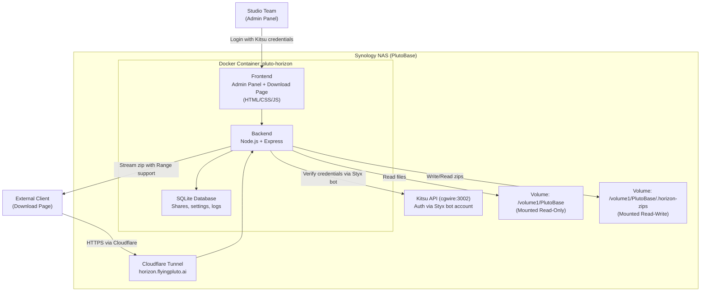

# Pluto Horizon — Studio File Sharing Web App (MVP)

A self-hosted, studio-branded web app that lets your team share DI/VFX deliverables with external clients via secure, resumable download links. Runs as a Docker container on your Synology NAS, accessible at `horizon.flyingpluto.ai`.

---

## Architecture Overview



---

## Authentication — Kitsu via Styx Bot

Same pattern as the attendance tracker. The Styx bot account authenticates users against Kitsu's API.

**Login Flow:**
1. User enters their **Kitsu email + password** on the Pluto Horizon login page
2. Backend calls Kitsu API: `POST http://cgwire:3002/api/auth/login` with the user's credentials
3. If valid, Kitsu returns user data including their role (`admin`, `manager`, `user`)
4. Backend issues a JWT session token with the user's name, email, and role
5. Role-based access:
   - **Admin / Manager** → Full access: browse files, create shares, manage settings, revoke links
   - **Employee (user)** → Can browse files and create share links, but cannot change settings

**Styx Bot Account Usage:**
- The bot account (`styx@flyingpluto.ai`) is used to call Kitsu API endpoints that require admin privileges (e.g., listing all users for audit logs)
- Bot credentials are stored as environment variables in the container
- User authentication is done directly against Kitsu — the bot is NOT used to proxy user logins

---

## User Flows

**Studio Team (Admin/Employee):**
1. Go to `horizon.flyingpluto.ai`
2. Log in with Kitsu credentials (email + password)
3. Browse the NAS file tree visually
4. Select a folder (e.g. `Media/Projects/Pluto/DI/Reel_04/Shot_043/`)
5. Click **"Create Share Link"** → set expiry + download limit (configurable defaults from settings)
6. Server pre-zips in background → progress bar shown
7. Once ready, a share link is generated (e.g. `horizon.flyingpluto.ai/d/a8f3c2`)
8. Copy link → send to client via email/WhatsApp/Slack

**External Client (Download):**
1. Open the share link in any browser
2. See a clean, branded download page: file name, size, expiry countdown
3. Click **"Download"**
4. Browser downloads the `.zip` with full resume support
5. If download fails → Resume in browser download manager

**Admin Settings Panel:**
- Default link expiry (days) — configurable
- Default max downloads per link — configurable
- Browse root path restriction — limit which folders are visible

---

## Proposed Changes

### Backend (Node.js + Express)

#### [NEW] [server.js](file:///c:/AI/server-check/pluto-horizon/server.js)
Main Express application:

| Route | Method | Auth | Purpose |
|---|---|---|---|
| `POST /api/auth/login` | POST | Public | Authenticate via Kitsu API |
| `GET /api/auth/me` | GET | JWT | Get current user info |
| `GET /api/files?path=` | GET | JWT | Browse NAS directory tree |
| `POST /api/shares` | POST | JWT | Create share link (triggers zip) |
| `GET /api/shares` | GET | JWT | List all active share links |
| `DELETE /api/shares/:id` | DELETE | JWT (admin) | Revoke a share link |
| `GET /api/shares/:id/status` | GET | JWT | Check zip progress |
| `GET /api/settings` | GET | JWT (admin) | Get app settings |
| `PUT /api/settings` | PUT | JWT (admin) | Update app settings |
| `GET /d/:token` | GET | Public | Download page (serves HTML) |
| `GET /d/:token/download` | GET | Public | File download with `Accept-Ranges` |

Key implementation details:
- **Kitsu Auth:** Proxies login to Kitsu API at `http://cgwire:3002/api/auth/login`. On success, issues a local JWT with user role.
- **File browsing:** `fs.readdir` on mounted volume. Returns names, sizes, dates. Filters hidden/system files.
- **Zip creation:** Background worker using `archiver` npm package. Tracks progress via file size monitoring.
- **Download serving:** Static file serving with `Accept-Ranges: bytes` for resume support.
- **Settings:** Stored in SQLite. Admin-only endpoints for expiry, download limits, browse root.

#### [NEW] [db.js](file:///c:/AI/server-check/pluto-horizon/db.js)
SQLite database initialization and queries.

```sql
CREATE TABLE shares (
    id TEXT PRIMARY KEY,
    token TEXT UNIQUE NOT NULL,
    source_path TEXT NOT NULL,
    zip_filename TEXT,
    zip_size INTEGER,
    status TEXT DEFAULT 'zipping',  -- 'zipping' | 'ready' | 'expired' | 'revoked'
    zip_progress INTEGER DEFAULT 0,
    download_count INTEGER DEFAULT 0,
    max_downloads INTEGER DEFAULT 10,
    created_by TEXT,                 -- Kitsu user email
    created_at DATETIME DEFAULT CURRENT_TIMESTAMP,
    expires_at DATETIME NOT NULL,
    downloaded_by TEXT               -- JSON array of {timestamp, ip}
);

CREATE TABLE settings (
    key TEXT PRIMARY KEY,
    value TEXT NOT NULL
);
-- Default settings inserted on first run:
-- default_expiry_days: 7
-- default_max_downloads: 10
-- browse_root: /data/nas
```

#### [NEW] [kitsu-auth.js](file:///c:/AI/server-check/pluto-horizon/kitsu-auth.js)
Kitsu authentication module:
- `authenticateUser(email, password)` → calls Kitsu API, returns user object with role
- `verifyToken(jwt)` → middleware to protect admin routes
- `requireRole('admin')` → middleware to restrict to admin/manager roles

#### [NEW] [zipper.js](file:///c:/AI/server-check/pluto-horizon/zipper.js)
Background zip worker using `archiver` npm package.

#### [NEW] [cleanup.js](file:///c:/AI/server-check/pluto-horizon/cleanup.js)
Hourly cleanup: deletes expired zips from disk, updates DB status.

---

### Frontend (Vanilla HTML/CSS/JS)

#### [NEW] [public/index.html](file:///c:/AI/server-check/pluto-horizon/public/index.html)
Admin panel — single-page app with:
- **Login screen:** Kitsu email + password with studio branding
- **File browser:** Tree view of NAS directories with folder sizes and breadcrumb navigation
- **Share creation modal:** Select folder → set expiry (days) + max downloads → create
- **Active shares table:** Token, path, status, download count, expiry, revoke button
- **Settings panel (admin only):** Default expiry, max downloads, browse root
- **Zip progress:** Real-time progress bar (polls status endpoint)

#### [NEW] [public/index.css](file:///c:/AI/server-check/pluto-horizon/public/index.css)
Premium dark design system:
- Deep navy/charcoal backgrounds (`#0a0e1a`, `#141827`)
- Accent: Electric blue gradient (`#4F9CF7` → `#6C63FF`)
- Glassmorphism cards with `backdrop-filter: blur`
- Smooth micro-animations (hover, click, transitions)
- Google Font: Inter
- Responsive layout (mobile-friendly download page)

#### [NEW] [public/download.html](file:///c:/AI/server-check/pluto-horizon/public/download.html)
Public download page — clean, minimal, studio-branded:
- Flying Pluto studio logo
- File name, size (human-readable), expiry countdown timer
- Large animated **"Download"** button
- States: preparing (zip in progress), ready, expired, revoked, limit reached

---

### Docker & Deployment

#### [NEW] [Dockerfile](file:///c:/AI/server-check/pluto-horizon/Dockerfile)
```dockerfile
FROM node:20-alpine
WORKDIR /app
COPY package.json package-lock.json ./
RUN npm ci --production
COPY . .
EXPOSE 8080
CMD ["node", "server.js"]
```

#### [NEW] [docker-compose.yml](file:///c:/AI/server-check/pluto-horizon/docker-compose.yml)
```yaml
services:
  pluto-horizon:
    build: .
    container_name: pluto-horizon
    restart: unless-stopped
    ports:
      - "8085:8080"
    volumes:
      - /volume1/PlutoBase:/data/nas:ro
      - /volume1/PlutoBase/.horizon-zips:/data/zips
      - horizon-db:/data/db
    environment:
      - BASE_URL=https://horizon.flyingpluto.ai
      - KITSU_API_URL=http://cgwire:3002/api
      - STYX_EMAIL=styx@flyingpluto.ai
      - STYX_PASSWORD=${STYX_PASSWORD}
      - JWT_SECRET=${JWT_SECRET}
      - ZIP_DIR=/data/zips
      - NAS_DIR=/data/nas
      - DB_DIR=/data/db
    networks:
      - kitsu_kitsu-network   # Connect to Kitsu's network to reach cgwire

  cloudflared-horizon:
    image: cloudflare/cloudflared:latest
    container_name: cloudflared-horizon
    command: tunnel --no-autoupdate run --token ${TUNNEL_TOKEN_HORIZON}
    restart: always

volumes:
  horizon-db:

networks:
  kitsu_kitsu-network:
    external: true
```

#### [NEW] [.env](file:///c:/AI/server-check/pluto-horizon/.env)
```env
STYX_PASSWORD=<styx bot password>
JWT_SECRET=<random secret>
TUNNEL_TOKEN_HORIZON=<cloudflare tunnel token for horizon.flyingpluto.ai>
```

---

## File Structure

```
c:\AI\server-check\pluto-horizon\
├── server.js              # Express app + API routes
├── db.js                  # SQLite setup + queries
├── kitsu-auth.js          # Kitsu authentication module
├── zipper.js              # Background zip worker
├── cleanup.js             # Auto-delete expired zips
├── package.json           # Dependencies
├── Dockerfile             # Container build
├── docker-compose.yml     # Deployment config
├── .env                   # Secrets (not committed)
└── public/                # Frontend files
    ├── index.html         # Admin panel (login + file browser + settings)
    ├── index.css          # Design system + styles
    ├── admin.js           # Admin panel logic
    ├── download.html      # Public download page
    └── download.js        # Download page logic
```

---

## Build & Deploy Steps

1. **Build locally** on this Windows machine — test all API routes and UI
2. **Copy to NAS** — `scp` the project folder to `/volume1/docker/Apps/PlutoHorizon/`
3. **Create Cloudflare Tunnel** — set up `horizon.flyingpluto.ai` pointing to `pluto-horizon:8080`
4. **Docker compose up** on the NAS — build and start the container
5. **Verify** — test end-to-end: login, browse, share, download from external device

## Verification Plan

### Automated Tests
1. Run `node server.js` locally with a test folder
2. Test Kitsu auth against the live Kitsu instance
3. Test zip creation, progress tracking, and download with resume
4. Test expiry and cleanup
5. Test settings CRUD (admin only)

### Manual Verification
1. Docker deployment on PlutoBase
2. Access via `horizon.flyingpluto.ai`
3. Full end-to-end: login → browse → share → download from phone/other device
4. UI polish check on desktop and mobile
